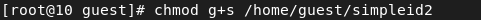

---
# Front matter
lang: ru-RU
title: Защита лабораторной работы №5. Дискреционное разграничения прав в Linux. Исследование влияния дополнительных атрибутов 
author: "Бурдина Ксения Павловна"
group: NFIbd-01-19
institute: RUDN University, Moscow, Russian Federation
date: 2022 Oct 5th

# Formatting
toc: false
slide_level: 2
header-includes: 
 - \metroset{progressbar=frametitle,sectionpage=progressbar,numbering=fraction}
 - '\makeatletter'
 - '\beamer@ignorenonframefalse'
 - '\makeatother'
aspectratio: 43
section-titles: true
theme: metropolis

---

# Результат выполнения лабораторной работы №5

# Цель выполнения лабораторной работы 

## Цель выполнения лабораторной работы

- Изучение механизмов изменения идентификаторов, применения SetUID- и Sticky-битов
- Получение практических навыков работы в консоли с дополнительными атрибутами
- Рассмотрение работы механизма смены идентификатора процессов пользователей
- Влияние бита Sticky на запись и удаление файлов

# Результат выполнения лабораторной работы

## Результат выполнения лабораторной работы

Создание программы simpleid.c:

{width=90%}

## Результат выполнения лабораторной работы

Компиляция программы simpleid.c. Выполнение программ simpleid и id:

{width=90%}

{width=80%}

{width=90%}

## Результат выполнения лабораторной работы

Усложнение программы, добавление вывода действительных идентификаторов:

{width=90%}

## Результат выполнения лабораторной работы

Компиляция и запуск simpleid2.c:

{width=90%}

Изменение владельца файла и его атрибутов:

## Результат выполнения лабораторной работы

Проверка правильности установки новых атрибутов и смены владельца файла simpleid2. Запуск simpleid2 и id:

{width=90%}

{width=90%}

## Результат выполнения лабораторной работы

Действия относительно SetGID-бита:

{width=80%}

## Результат выполнения лабораторной работы

Создание программы readfile.c:

{width=80%}

## Результат выполнения лабораторной работы

Смена владельца файла readfile.c и изменение прав на чтение:

Проверка отсутствия возможности у пользователя guest прочитать файл readfile.c:

{width=90%}

## Результат выполнения лабораторной работы

Компиляция программы readfile.c:

Смена у программы readfile владельца и установка SetUID-бита:

## Результат выполнения лабораторной работы

Проверка чтения файла readfile.с программой readfile:

{width=70%}

## Результат выполнения лабораторной работы

Проверка чтения файла /etc/shadow программой readfile:

{width=90%}

## Результат выполнения лабораторной работы

Проверка установки атрибута Sticky на директории /tmp:

{width=85%}

Создание файла file01.txt в директории /tmp со словом test:

{width=85%}

Просмотр и расширение атрибутов для "остальных" пользователей:

{width=70%}

## Результат выполнения лабораторной работы

Чтение файла от пользователя guest2:

{width=85%}

Дозапись в файл от пользователя guest2 слова test2 и проверка содержимого файла:

{width=90%}

{width=85%}

## Результат выполнения лабораторной работы

Запись в файл /tmp/file01.txt слова test3 и проверка содержимого файла:

{width=90%}

Попытка удаления файла /tmp/file01.txt:

{width=90%}

## Результат выполнения лабораторной работы

Повышение прав до суперпользователя и снятие атрибута t (Sticky-бит) с директории /tmp и последующий выход из режима суперпользователя:

{width=90%}

## Результат выполнения лабораторной работы

Проверка отсутствия у guest2 атрибута t у директории /tmp:

Повтор предыдущих шагов:

{width=90%}

# Выводы

## Выводы

1. Изучили механизмы изменения идентификаторов, применения SetUID- и Sticky-битов;

2. Получили практические навыки работы в консоли с дополнительными атрибутами;

3. Рассмотрели работу механизма смены идентификатора процессов пользователей, а также влияние бита Sticky на запись и удаление файлов.
